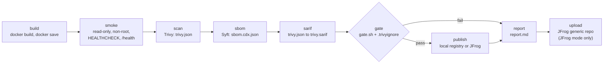

# devsecops-lab

[](https://github.com/isaev4lex/devsecops-lab/actions/workflows/ci.yml)

A container supply-chain pipeline driven by `make`. It builds a small Python
service into an image, smoke-tests it, scans it with Trivy, writes a CycloneDX
SBOM with Syft, applies a vulnerability gate, and only then pushes the image.
By default it pushes to a throwaway registry on your machine, so `make ci` needs
no accounts or credentials, only Docker and a few common command-line tools
(listed under [Run it locally](#run-it-locally-no-accounts)). JFrog Artifactory
is an optional target.

## What a published image comes with

For every image the pipeline pushes:

- **Traceable tag.** The tag is the short git commit (`98c8128386fb`), with
  `-dirty` appended if tracked files had uncommitted changes. The full commit
  SHA is in the `org.opencontainers.image.revision` label and `GET /version`
  returns the tag. Outside a git checkout (for example a downloaded archive)
  the tag is `src-` plus a hash of `app/Dockerfile` and `app/main.py`.
- **Scanned and gated.** Trivy scanned it for vulnerabilities and secrets and
  the gate policy below passed. `publish` refuses to run unless
  `build/gate.json` says `pass` and was computed from the current
  `build/trivy.json` (it records the scan's SHA-256). A new scan removes the
  previous gate result, and a gate run that fails to evaluate leaves none.
- **Same bytes as scanned.** The scanners read a `docker save` tarball. Before
  pushing, `publish` checks that the tarball's config digest equals the image
  ID Trivy recorded, loads that tarball, pushes it, then reads the manifest back
  from the registry with `docker buildx imagetools` and checks the config digest
  again. Without buildx, `publish` stops before pushing.
- **Evidence kept with it.** Scan JSON, SARIF, SBOM, gate decision and a
  Markdown report sit in `build/`, in the CI run artifacts, and in JFrog next
  to the image when publishing there.
- **Non-root, minimal runtime.** The image runs as uid 65532 on a distroless
  base (no shell, no package manager) and passes its smoke test with a
  read-only root filesystem, all capabilities dropped and `no-new-privileges`.

What it does not cover is listed under [Limitations](#limitations).

## Stages



| Target | What it does | Output in `build/` |
|---|---|---|
| `make build` | Builds `app/Dockerfile` as `devsecops-app:<rev>` with OCI labels, saves it | `image.tar` |
| `make smoke` | Runs the image read-only, no capabilities; checks non-root user, HEALTHCHECK, `/health`, `/version` | |
| `make scan` | Trivy on the tarball, vulnerabilities and secrets, no pass/fail; removes results of the previous scan | `trivy.json` |
| `make sbom` | Syft on the tarball, package-level CycloneDX | `sbom.cdx.json` |
| `make sarif` | Converts the MEDIUM and higher findings in `trivy.json` (`SARIF_SEVERITY`) to SARIF; results point at the Dockerfile `FROM` line, one fingerprint per CVE and package | `trivy.sarif` |
| `make gate` | Applies the policy, the only pass/fail decision | `gate.json` |
| `make publish` | Pushes the gated image (`PUBLISH=local\|jfrog\|none`) | `publish.json` |
| `make report` | Markdown summary of the above | `report.md` |
| `make upload` | Uploads the scan, SBOM, SARIF, gate result and report to the JFrog generic repo | |
| `make ci` | All of the above; the report is written even when the gate fails | |

Trivy, Syft and the local registry run from images pinned by version and digest
(`scripts/lib.sh`). The Trivy and Syft containers run as your user, with a
read-only root filesystem, no capabilities and `no-new-privileges`; their
inputs are mounted read-only and the only writable mount is Trivy's database
cache (`.cache/trivy`). None of them gets `/var/run/docker.sock`.

## Gate policy

| Rule | Default | Setting |
|---|---|---|
| Any finding at or above this severity fails, fixed or not | `CRITICAL` | `FAIL_ON_SEVERITY` |
| A finding at or above this severity fails if a fixed version exists | `HIGH` | `FAIL_ON_FIXABLE_SEVERITY` |
| A secret found in the image fails | always | waive by rule ID |

Severities are `UNKNOWN`, `LOW`, `MEDIUM`, `HIGH`, `CRITICAL`; `NONE` turns a
rule off. Example: `make gate FAIL_ON_SEVERITY=HIGH`.

Why this default: a HIGH finding in a base-image package with no fixed version
leaves nothing to change in this repository, so failing on it would keep the
pipeline red without a way to make it green. A HIGH finding with a fix means
the pinned base image is behind, and the fix is to bump its digest. The base
has no package manager, so a Debian fix only arrives with a rebuilt distroless
image: if Debian has fixed a package but no new distroless digest exists yet,
add a short-lived waiver (one or two weeks) and remove it with the digest bump
Dependabot proposes. CRITICAL findings fail either way and need a fix, a
different base, or a waiver with an expiry date.

As of 2026-10-05 the pinned base image has 0 CRITICAL and 26 HIGH findings, none
of them with a fixed version in Debian, so the gate passes. A weekly CI run
rescans `main` and will fail once a fix is published, which is the signal to
take the digest bump Dependabot proposes.

### Waivers

`.trivyignore` uses Trivy's own format, so `trivy --ignorefile .trivyignore`
reads the same file:

```
# libfoo heap overflow, only reachable through a parser the app never calls.
# No Debian fix yet. Owner: alex. Ticket: #12.
CVE-2026-12345 exp:2026-12-31
```

- Every entry needs `exp:YYYY-MM-DD`; an entry without one, or with an invalid
  date, is a configuration error (exit 1).
- A waiver stops applying on its expiry date (UTC), the same rule Trivy uses:
  `exp:2026-12-31` covers scans up to 2026-12-30. From then on the finding
  blocks again and the gate prints the expired entry.
- Entries that match no blocking finding are reported so they can be removed.
- Waived findings are listed in `gate.json` and in the report, not hidden.

Exit codes of `scripts/gate.sh`: `0` pass, `2` policy violation, `1` usage or
configuration error.

## Run it locally (no accounts)

Requirements: Docker (Docker Desktop, Docker Engine or colima) with the buildx
plugin, GNU Make 3.81 or newer, bash, jq, curl, python3. The tests need
Python 3.11 or newer (below).

```sh
make ci
```

This pulls the pinned Trivy, Syft and registry images, builds and checks the
image, starts a registry container named `devsecops-lab-registry` on
`127.0.0.1:5050` (storage in a tmpfs) and pushes to it. A run with warm caches
takes about 10 seconds. The first run also downloads the Trivy database, which
takes about 1.4 GB in `.cache/trivy` (gitignored; `make clean-cache` removes
it).

Pull the image back by digest:

```sh
docker pull "localhost:5050/devsecops-app@$(jq -r .digest build/publish.json)"
```

Other useful commands:

```sh
make help                     # list targets
make build smoke scan gate    # run some stages only
make ci PUBLISH=none          # skip the push
make registry-down clean      # remove the registry container and build/
make clean-cache              # remove the Trivy database cache
```

Tests and lint (`shellcheck` from `brew install shellcheck` or
`apt-get install shellcheck`). `requirements-dev.txt` is hash-locked for
Python 3.11 or newer, and the CI test job uses 3.13; the `/usr/bin/python3`
that ships with macOS (3.9) cannot install it.

```sh
python3.13 -m venv .venv      # or any python3.11+
.venv/bin/pip install --require-hashes -r requirements-dev.txt
make check                    # shellcheck + pytest
make lint-workflows           # actionlint on the CI workflow (runs in Docker)
```

The tests cover the app endpoints and healthcheck command, the gate policy
(thresholds, secrets, waivers and their expiry, malformed input, the committed
`.trivyignore`) by running `gate.sh` against generated Trivy reports, the
checks `publish.sh` makes before and after a push (failed or stale gate,
unscanned tarball, wrong image read back) and the SARIF rewrite with `docker`
replaced by a stub, the `lib.sh` helpers (tarball config digest, JFrog host
and its log mask, credentials stripped from the source URL label), and the
report rendering. They do not need Docker; `make ci` is the end-to-end check.

## Publish to JFrog Artifactory

```sh
cp .env.example .env    # uncomment and set ART_URL, ART_USER, ART_TOKEN
make bootstrap          # creates docker-local and generic-local if missing
make ci                 # publishes to JFrog when all three variables are set
```

- Image: `<instance>.jfrog.io/docker-local/devsecops-app:<rev>`
- Files: `generic-local/devsecops-app/<rev>/` with `trivy.json`,
  `sbom.cdx.json`, `trivy.sarif`, `gate.json` and `report.md`. Each upload
  sends its SHA-256 (`X-Checksum-Sha256`) for Artifactory to check.
- The token needs to push Docker images and deploy to the generic repo
  (`bootstrap` also needs to create repositories).
- The token goes to `docker login` on stdin and to curl through a config on
  stdin, so it does not appear in process listings.
- `bootstrap` leaves existing repositories unchanged.

## CI

`.github/workflows/ci.yml` runs on pushes and pull requests to `main`, weekly
on Monday, and on demand.

1. **test**: `make lint`, `make lint-workflows` and `make test`: shellcheck,
   actionlint and pytest on Python 3.13, the version in the image. Test
   dependencies are installed with `--require-hashes`.
2. **pipeline**: the `make ci` targets, one step each, so a failure points at
   a stage.
   - Publishes to JFrog only for pushes to `main` when the `ART_URL`,
     `ART_USER` and `ART_TOKEN` secrets exist. Pull requests, forks and the
     weekly run push to a local registry on the runner, so they run the whole
     pipeline without secrets. Credentials are passed only to the steps that
     use them.
   - Uploads `trivy.sarif` to GitHub code scanning, also when the gate fails
     (skipped for pull requests from forks, whose token is read-only).
   - Keeps the SBOM, scan, SARIF, gate result and report as the workflow
     artifact `supply-chain-<sha>` for 30 days, and adds the report to the
     job summary.
3. **sign** (opt-in): after a JFrog push, if the repository variable
   `SIGN_IMAGES` is `true`, signs the image digest with keyless cosign
   (Sigstore certificate for the workflow's OIDC identity, no stored key),
   attaches the SBOM as a signed CycloneDX attestation, and verifies both. It is
   a separate job so `id-token: write` is not granted to the job that runs
   third-party scanner containers. It is off by default because keyless
   signing writes an entry to the public Rekor transparency log.

To check a signature:

```sh
cosign verify \
  --certificate-identity https://github.com/isaev4lex/devsecops-lab/.github/workflows/ci.yml@refs/heads/main \
  --certificate-oidc-issuer https://token.actions.githubusercontent.com \
  <instance>.jfrog.io/docker-local/devsecops-app@sha256:<digest>
```

Workflow hardening: read-only default token permissions with per-job
additions, every action pinned to a full commit SHA, checkout without
persisted credentials, the JFrog host masked in the logs (GitHub masks the
`ART_URL` secret, not the bare host that docker and cosign print), and
Dependabot for action SHAs, the base image digest and the Python test
dependencies.

## Example report

`build/report.md` from a local run (HIGH table shortened):

```markdown
# Security report

| Item | Value |
|---|---|
| Image | `devsecops-app:98c8128386fb` |
| Commit | `98c8128386fbbed75c3edc431360110900c96b5b` |
| Image ID | `sha256:276100318d92d5bb4e8afcc3d39e0aecbc5dee8b38c4986f7f22584d4e82c672` |
| Base OS | debian 13.7 |
| Platform | linux/arm64 |
| User | `65532:65532` |
| Scanned | 2026-10-05T16:22:26Z with Trivy 0.74.0 |
| Published | `devsecops-app@sha256:f97d68130424a0c1aff6975b64914f542e3ebf56789f4be65bc441e2604e8236` (local registry localhost:5050) |

## Gate: PASS

Policy: fail on any CRITICAL or above finding; fail on HIGH or above when a fixed version exists; any secret fails.
Waivers: `.trivyignore`, 0 finding(s) waived, 0 expired entries.

Blocking findings: none.

## Vulnerabilities

| Severity | Total | Fix available |
|---|---:|---:|
| CRITICAL | 0 | 0 |
| HIGH | 26 | 0 |
| MEDIUM | 74 | 0 |
| LOW | 53 | 0 |
| UNKNOWN | 5 | 0 |

Secrets found: 0.

HIGH and CRITICAL findings:

| Severity | ID | Package | Installed | Fixed | Status |
|---|---|---|---|---|---|
| HIGH | CVE-2026-66046 | libexpat1 | 2.8.3-1~deb13u1 | - | affected |
| HIGH | CVE-2026-76956 | libexpat1 | 2.8.3-1~deb13u1 | - | affected |
| HIGH | CVE-2026-15308 | libpython3.13-minimal | 3.13.5-2+deb13u5 | - | affected |
| ... | | | | | |

## SBOM

- Format: CycloneDX 1.7 (JSON), generated by syft 1.52.0
- Components: 39 (library: 38, operating-system: 1)
- File: `sbom.cdx.json`
```

## Repository layout

```
app/                 main.py (stdlib HTTP service), Dockerfile, .dockerignore
scripts/             one script per stage; lib.sh holds helpers and pinned tool images
tests/               pytest: app, gate, publish checks, SARIF, lib.sh, report (docker stub in conftest.py)
.trivyignore         gate waivers (format described in the file)
.env.example         optional settings and JFrog credentials
.github/             CI workflow and Dependabot config
```

## Limitations

- A gate result is only as current as the Trivy database at scan time. An image
  that passed last week can fail today; the weekly CI run catches that for
  `main`, but images already pushed are not rescanned in the registry.
- GitHub disables scheduled workflows in a public repository after 60 days
  without repository activity, so on a quiet repository the weekly rescan
  stops until it is re-enabled in the Actions tab.
- Trivy sees OS packages and language package manifests. The app is a single
  stdlib script with no dependencies, so its own code is not analysed: there is
  no SAST or linting of `main.py` beyond the tests.
- Builds are not bit-for-bit reproducible (build timestamp label, layer
  metadata). The tag identifies the commit; the digest identifies one build.
- The image is built for the host architecture only (arm64 on Apple Silicon,
  amd64 in CI).
- The pipeline does not generate or verify SLSA provenance. (With the
  containerd image store, as in Docker Desktop, BuildKit attaches its own
  minimal provenance attestation to the image index; nothing checks it.)
  Signing is opt-in, runs only for JFrog pushes from CI, and the pipeline does
  not verify signatures before deploying anything (there is no deploy stage).
- The Trivy, Syft and registry image pins in `scripts/lib.sh` and the
  actionlint pin in the `Makefile` are not seen by Dependabot and have to be
  bumped by hand.
- The JFrog and signing paths need credentials, so pull request CI does not
  run them against a real registry. The tests run `publish.sh` in JFrog mode
  with `docker` stubbed; signing is not tested.
- The local registry is plain HTTP on 127.0.0.1 without authentication. It is
  meant to be thrown away.
- Scripts need bash, jq and Docker; Windows outside WSL is not supported.

## License

MIT, see [LICENSE](LICENSE).
